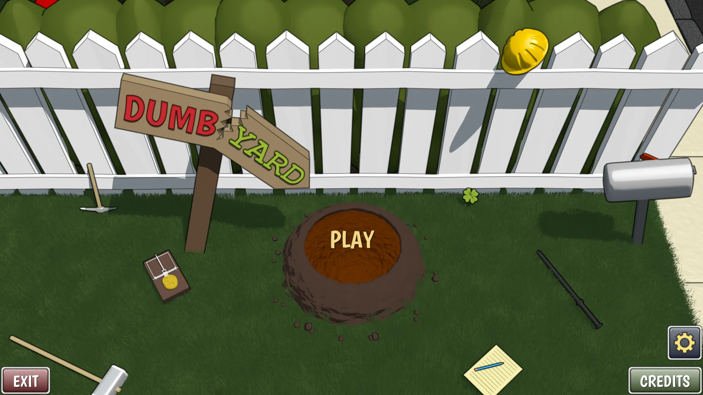
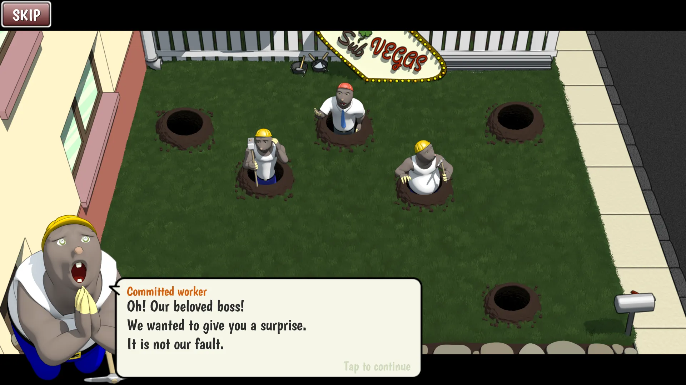
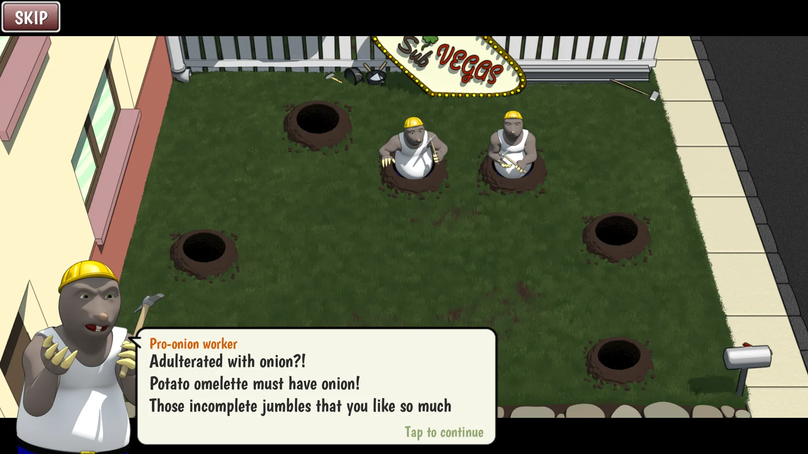
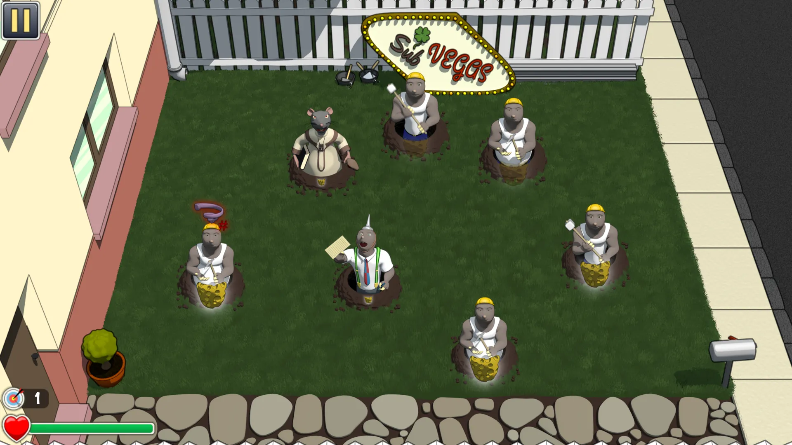
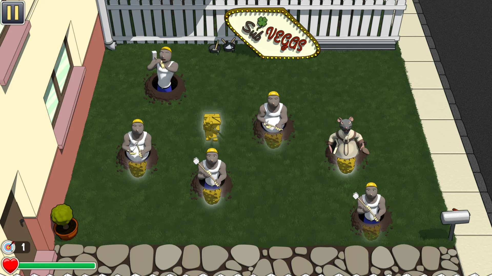
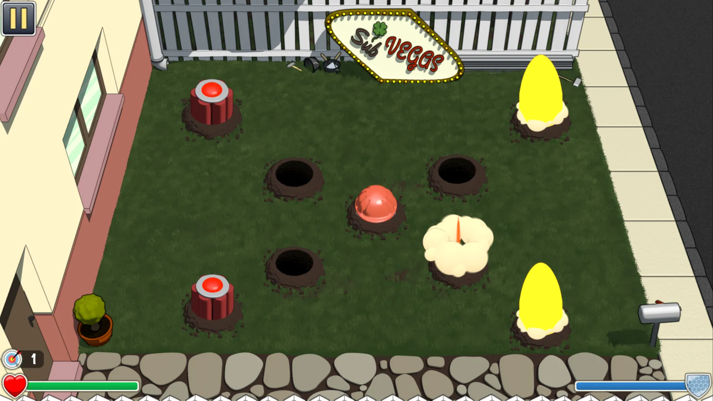
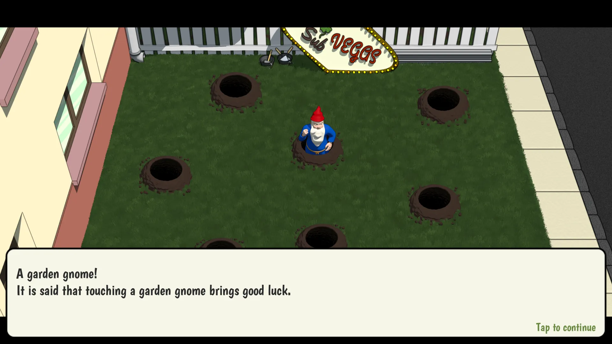
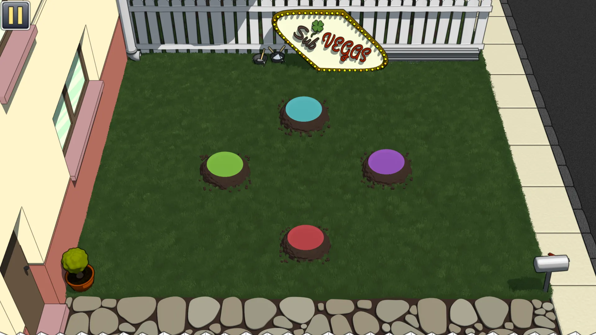
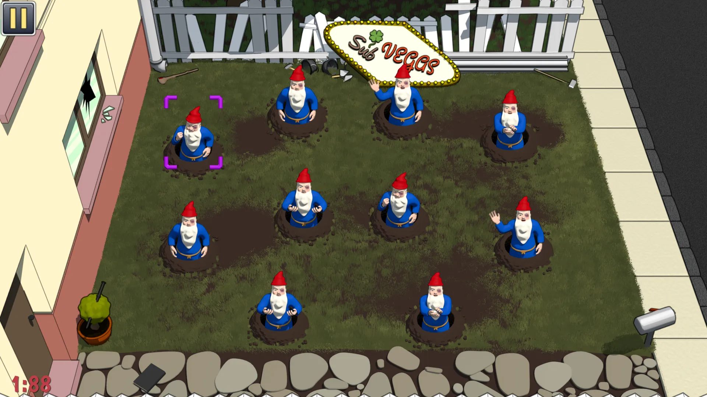

# DUMBYARD

More than just a "whack a mole" game.

The yard was a quiet, clean and tidy place. The perfect place in which any self-respecting garden gnome would like to live, like one of those gnomes who wash their beards at least five times a day. But then, those creatures came with their screams, their peaks and their holes... and they started to build something in the yard!

Get ready to use all your skills fighting hordes of dumb creatures. Stop them before they destroy the yard!

## Features

* Dive into a hilarious story and discover the consequences of unlimited stupidity.
* Defeat hordes of enemies.
* Fight against powerful, beloved and crazy final bosses.
* Overcome the garden gnome's challenges to obtain improvements.
* Save the garden. Save the world!

## About this game

This game is not about whack enemies non stop without thinking too much. You can play that way the first levels, but you will fail miserably if you continue with that behaviour after those levels. To complete this game you will have to be a good observer, have good reflexes and know when to attack. Also, you'll have to discover for yourself the mechanics to get rid of the bosses.

This game is focused on players who are looking for challenges and who like to immerse themselves in the story of what they are playing. If you are that type of player, go ahead! I hope you have fun and that you get all the way to the end.

And if you like it, do not forget that you can always buy the paid version in [Play Store](https://play.google.com/store/apps/details?id=com.jpalaciosdev.dumbyard). If you do... Thanks for your support! You have my gratitude!

Have fun!

## Screenshots

* 
* 
* 
* 
* 
* 
* 
* 
* 

## Privacy Policy
This game does not collect, process or share any type of user data.

## About this game & contact info
Created by [Juan Palacios](mailto:jpalaciosdev@gmail.com). Copyright © 2017-2024.
